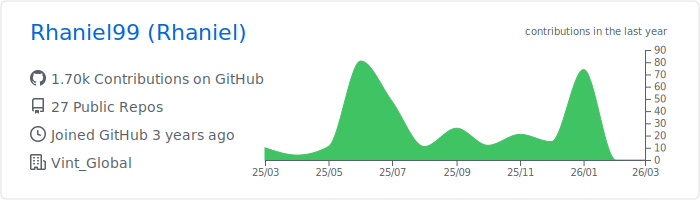

# Bem-vindo ao meu perfil do GitHub!

Olá! Sou Rhaniel, um entusiasta da tecnologia apaixonado por desenvolvimento de software. Tenho experiência em diversas tecnologias e estou constantemente buscando aprender e expandir meu conhecimento. Abaixo estão algumas das áreas em que tenho experiência:

- **Node.js**: Tenho experiência sólida no desenvolvimento de aplicativos back-end e APIs utilizando Node.js. Adoro trabalhar com JavaScript e explorar as novas funcionalidades do ecossistema Node.

- **Banco de Dados**: Tenho conhecimento em bancos de dados relacionais, como PostgreSQL e MySQL, e posso criar esquemas, consultas complexas e otimizações.

- **Flutter**: Sou entusiasta do Flutter e posso criar aplicativos móveis multiplataforma atraentes e funcionais usando esta poderosa estrutura.

- **PHP (Laravel)**: Tenho experiência no desenvolvimento de aplicativos web usando Laravel, um dos melhores frameworks PHP disponíveis atualmente.

- **Python (Flask)**: Adoro trabalhar com Flask para criar aplicativos web leves e eficientes em Python.

Estou sempre em busca de novos desafios e oportunidades de aprendizado. Se você tiver alguma pergunta, sugestão ou desejar colaborar em projetos interessantes, fique à vontade para entrar em contato comigo. Vamos construir coisas incríveis juntos!

Além disso, você pode verificar meus repositórios aqui no GitHub para ver alguns dos projetos em que tenho trabalhado recentemente. Obrigado por visitar o meu perfil!

  

  
 

#### 👉   _[Statistics](https://github.com/anuraghazra/github-readme-stats) ➕  [Summary Cards](https://github.com/vn7n24fzkq/github-profile-summary-cards) ➕  [Snake animation](https://github.com/Platane/snk) ➕  [Metrics](https://github.com/marketplace/actions/metrics-embed)_
