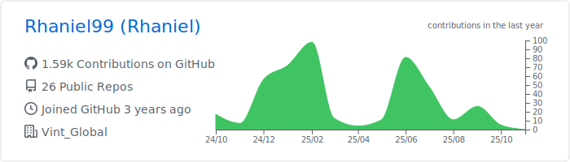

# Bem-vindo ao meu perfil do GitHub!

Olá! Sou Rhaniel, um entusiasta da tecnologia apaixonado por desenvolvimento de software. Tenho experiência em diversas tecnologias e estou constantemente buscando aprender e expandir meu conhecimento. Abaixo estão algumas das áreas em que tenho experiência:

### Linguagens e Ferramentas 🛠

   

    

     

    

Além disso, você pode verificar meus repositórios aqui no GitHub para ver alguns dos projetos em que tenho trabalhado recentemente. Obrigado por visitar o meu perfil!

  

  

